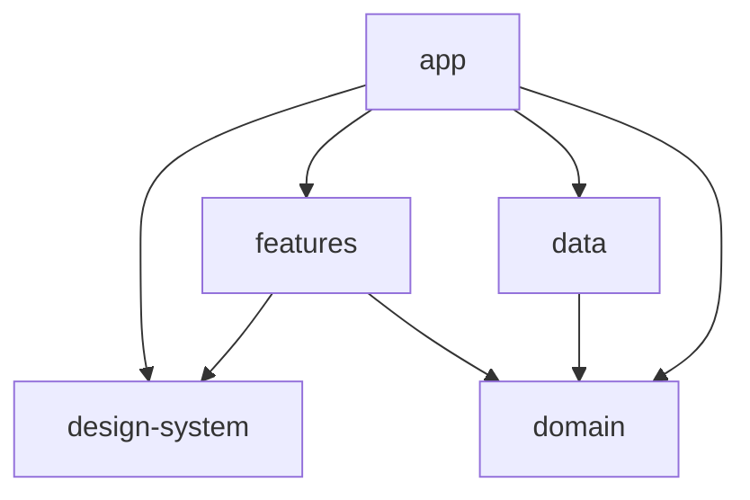
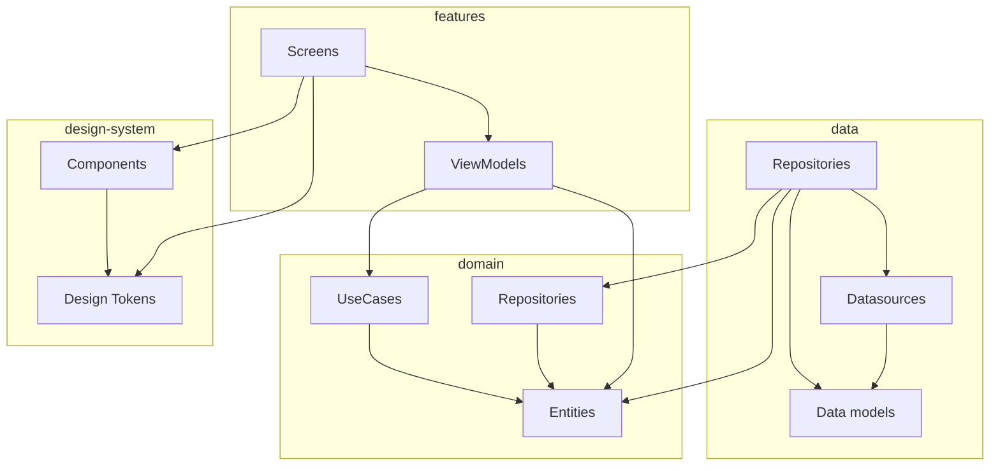

# github-viewer

GitHub ユーザーを閲覧できるアプリ

# 環境構築

API Limit の上限を上げたい場合は `secret.properties` をプロジェクトのルートに追加して、`GITHUB_TOKEN`
を追加してください

# 使用技術

- Hilt
- OkHttp
- Retrofit
- Kotlin Serialization
- Coroutines
- Jetpack Compose
- Roborazzi
- Composable Preview Scanner

# 各モジュールの依存関係

## 概要

## 詳細

